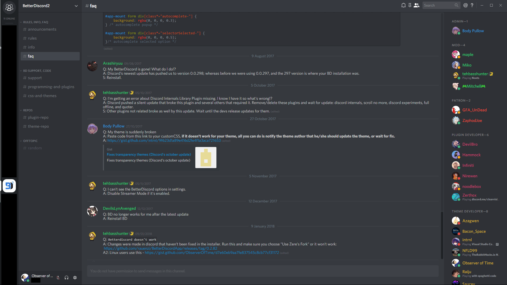

# Restore Titlebar

**Restores the old Windows titlebar.**

## Preview

## Applying
_(checkmark = autoupdating)_

- Option 1: Copy the [code](src/RestoreTitlebar.css) and paste it into your custom CSS (or another theme).
- ✓ Option 2: Write the following line in your custom CSS (or another theme): `@import url("https://observeroftime.github.io/DiscordThemes/MiniThemes/RestoreTitlebar/src/RestoreTitlebar.min.css");`
