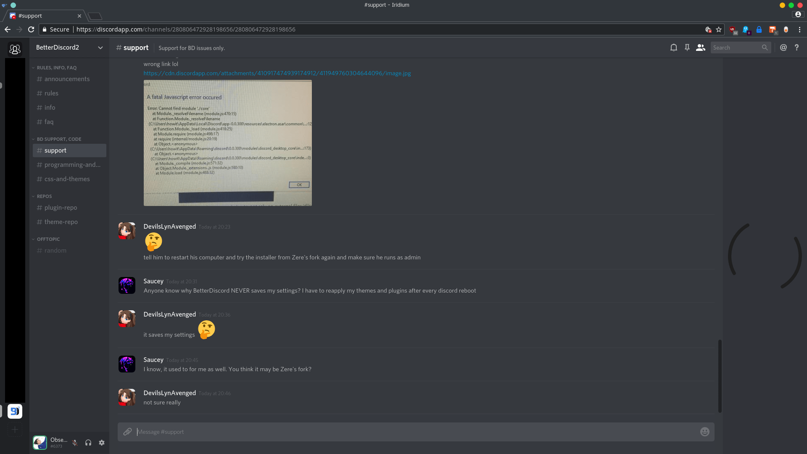

# Nihilism

**A dark and compact theme, designed for use with Discord's dark theme.**

## Features

- Compact lists
- Rounded square avatars
- Status borders
- Bigger emoji
- Hide blocked messages
- Hide title bar _(windows)_
- Hide apps button _(web)_
- Hide unnecessary scrollbars
- No light elements

## Previews

### Desktop

### Web

## Installation

### Desktop

### Web

