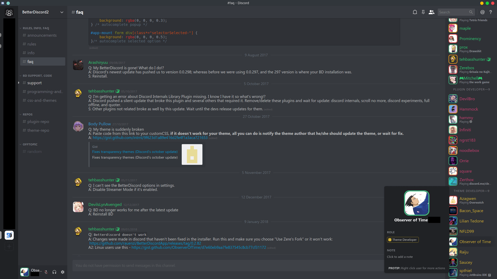
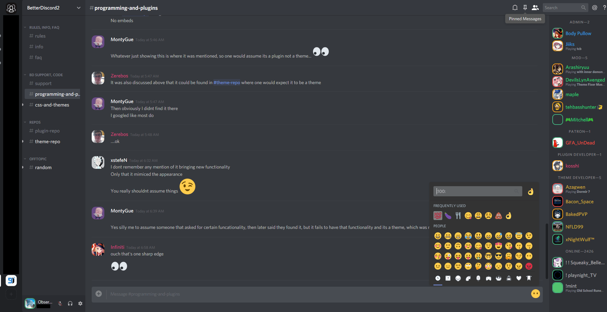

# Nihilism

**A dark and compact theme designed for use with Discord's dark theme.**

## Features

- Compact lists
- Rounded square avatars
- Status borders
- Bigger emoji
- Hide blocked messages
- Hide title bar _(windows)_
- Hide apps button _(web)_
- Hide unnecessary scrollbars
- No light elements

## Previews

### Desktop

### Web

## Applying

_(checked = autoupdating)_

### Desktop
- [ ] Option 1:
  - [Download](https://betterdiscord.net/ghdl?id=1345) the theme
  - Place it in BetterDiscord's theme folder
  - Reload and enable it in your settings
- [x] Option 2:
  - Write the following line in your custom CSS: `@import url("https://observeroftime.github.io/DiscordThemes/NewNihilism/src/NewNihilism.min.css");`
  - Click `Save` and `Update`

### Web

- [ ] Install the theme from [Userstyles](https://userstyles.org/styles/147291/)
